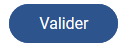
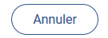
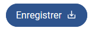
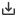
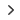
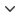
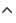
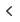
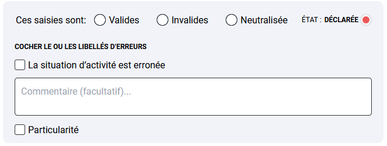

# Design system RCI

Projet de design system construit sur Angular v13 et Compodoc.

Le projet comprends deux structures distincts :

- un site implémentant les composants [Démonstration](/)
- une documentation des composants et le style associé [Documentation Design RCI](/doc/index.html)

## Thematique de couleurs

voir le fichier `_variables.scss` dans le dossier styles.

il contient la thematique couleur du site RCI.

Il est possible de modifier ces variables,

> ⚠️  la modification d'une variable aura un impact sur l'ensemble des compososants ainsi que sur l'accessibilité .


```scss
// Colors
:root{
    --shadow-box : 0px 0px 4px rgba(0, 0, 0, 0.25);
    //opacity
    --color-opacity : 1;

     /* ====================
            grey color 
        ==================== */      
    --c-grey-300 : #e0e0e0;
    --c-grey-500 : #828282;
    --c-grey-700: #333333;

    /* ====================
            blue color 
        ==================== */   
    --c-blue-100 : #F1F3F9;
    --c-blue-300 : #6c87b0;
    --c-blue-500 : #2e548e;
    --c-blue-700: #0F2951;

    --c-state-declared : #eb5757;
    --c-state-revised : #1f5de3;
    --c-state-neutralized : #9b51e0;
    --c-state-disputed : #f2994a; 
    --c-state-fixed : var(--c-grey-500); 
}
```


___

# Boutons
[Documentation du composant](/doc/components/ButtonsComponent.html)
```html
  <app-buttons class="btn-primary" 
  [text]="'Enregistrer'" 
  [reverse]="false"/>
``` 

---

|PRIMAIRE|SECONDAIRE|ICONE|
|:-------|:----------|:--------|
|`class='btn-primary'`|no class|`class="btn-primary "`<br>`<app-icones icone [nameIcone]="'arrow-right'"></app-icones>`|
||||


---
# Boutons radio

[Documentation du composant](/doc/components/RadioButtonComponent.html)

 appel du composant :

```html
 <app-radio-button
    [dataInputs]="[{name : 'Kobolds', value:'kobold-1'},{name : 'Elves', value:'elfe-1'}," 
    [groupName]="'Fantasy'">
</app-radio-button>
```

le composant prend en paramètre un tableau d'objets ```dataInputs[]``` composé de la facon suivante :

``` 
[dataInputs]="[{name : 'Kobolds', value:'kobold-1'},{name : 'Elves', value:'elfe-1'},]"

name => affiche le label
value => set la value du bouton radio

```
et d'un ```groupName``` qui définit le name attribut des boutons radios
```
[groupName]="'Fantasy'"
```
___

## Icones

les icones sont insérées par la projection de contenu via le composant `app-icones`

```html

<app-buttons class="btn-primary" [text]="'Précédant'"  [reverse]="true">
  <app-icones icone [nameIcone]="'arrow-left'"></app-icones>
</app-buttons>

```

liste ```[nameIcone]``` :

|  apercu           |    type     |
|:--------|:----------:|
| | save |
|   | arrow-right |
|  | arrow-down |
|  | arrow-up |
|  | arrow-left |


## Inputs

[Documentation du composant](/doc/components/InputComponent.html)

appel du composant : `app-input`

```html

<div class="flex items-center gap-2">
  <label for="">Saisie montant</label>
  <app-input class=" data-currency" [type]="'number'"></app-input>
</div>

```
---
## Checkbox

[Documentation du composant](/doc/components/CheckboxComponent.html)

Appel du composant :

```html
  <app-checkbox [idInput]="'check_1'" [val]="'v1'" [labelInnerText]="'checkbox 1'"></app-checkbox>
```

le composant prend 3 paramètres :

```[idInput]``` correspond a l'id , nécessaire pour associer le label à l'input 

```[val]``` définit la valeur de la checkbox

```[labelInnerText]``` texte du label 

---

## DropDown


[Documentation du composant](/doc/components/DropdownComponent.html)

Appel du composant :

```html
  <app-dropdown [listOptions]="fakeData" [isDisabled]="true"></app-dropdown>
```

le composant prend 2 paramètres :

```[listOptions]``` liste d'objets 

```[isDisabled]``` optionel 

## States

[Documentation du composant](/doc/components/StateComponent.html)

Appel du composant :

```html
  <app-state [label]="'declared'"></app-state>
```

liste des énumérations:

|KEY|VALUE|
|:-------|:----------|
|declared|DÉCLARÉE|
|revised|CORIGÉE|
|neutralized|NEUTRALISÉE|
|disputed|CONTESTÉE|
|fixed|SAISIE|


## TextArea

[Documentation du composant](/doc/components/TextareaComponent.html)

Appel du composant:

```html
<app-textarea [placeholder]="'Commentaire (facultatif)...'"></app-textarea>

```
<br>

## Module 1

[Documentation du composant](/doc/components/Module1Component.html)

 


<br>        </br>